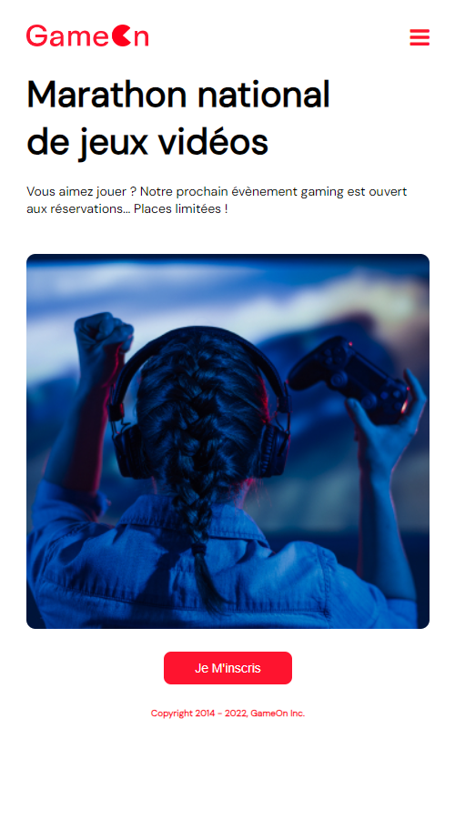
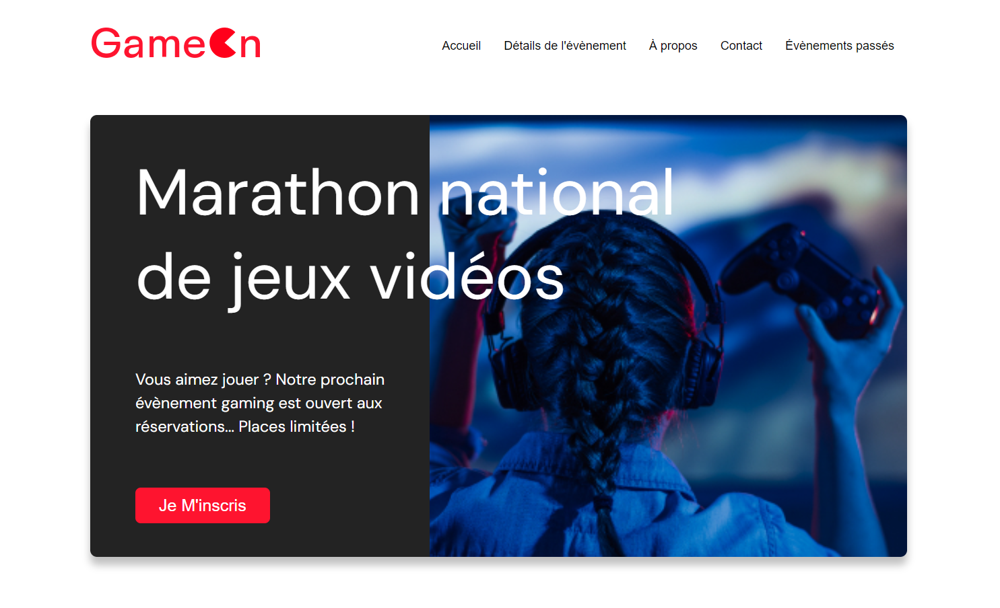

# Bootcamp Project GameOn - Créer une landing page avec Javascript

## Scénario 

Vous avez récemment été embauché comme développeur Front-End junior chez GameOn, une PME spécialisée dans les conférences et concours de jeux. Votre mission est de reprendre un projet de formulaire d'inscription laissé par un développeur précédent et de le compléter pour le rendre pleinement fonctionnel.

<hr style="background-color:black">




<hr style="background-color:black">

## Informations Générales
Le formulaire d'inscription a été partiellement réalisé par Jason, un ancien employé. Il a travaillé sur la structure HTML, la mise en page CSS, et une partie du JavaScript. Votre tâche consiste à finaliser le JavaScript manquant et à assurer le bon fonctionnement du formulaire, en respectant les directives suivantes :
- Travailler sur un repo GitHub forké
- Séparer les fichiers HTML, CSS et JavaScript
- Ajouter des commentaires pour chaque fonction et classe
- Tester manuellement les fonctionnalités et assurer la compatibilité responsive

## Missions
1. **Analyse du code existant** : Comprendre le travail déjà effectué par Jason et lire les issues créées sur GitHub.
2. **Ajout du JavaScript manquant** : Implémenter les fonctionnalités manquantes pour rendre le formulaire pleinement fonctionnel.
3. **Tests manuels** : Valider les entrées du formulaire et vérifier que le site est responsive.
4. **Commentaires** : Ajouter des commentaires dans le code pour expliquer les fonctions, classes et sections complexes.

## Technologies Utilisées
- **HTML5** : Structure du site
- **CSS3** : Mise en page et style
- **JavaScript** : Fonctionnalités dynamiques du formulaire
- **Git & GitHub** : Gestion de version et collaboration

## Installation
Pour installer et lancer le projet localement, suivez les étapes suivantes :

1. **Cloner le repo forké** :
```bash
git clone https://github.com/Vanda89/GameOn-website-FR
```

2. **Accéder au dossier du projet** :
```bash
cd gameon-form
```

## Liens utiles

- Maquettes Figma du projet : [Lien](https://www.figma.com/design/XI9iTrmPPMDq1HVrGEuMez/UI-Design-GameOn-FR-(Copy)?node-id=0-1&node-type=canvas&t=ri8BjXFYWlXNJEsR-0)
- Lien vers Github Page : [GameOn](https://vanda89.github.io/GameOn-website-FR/)
